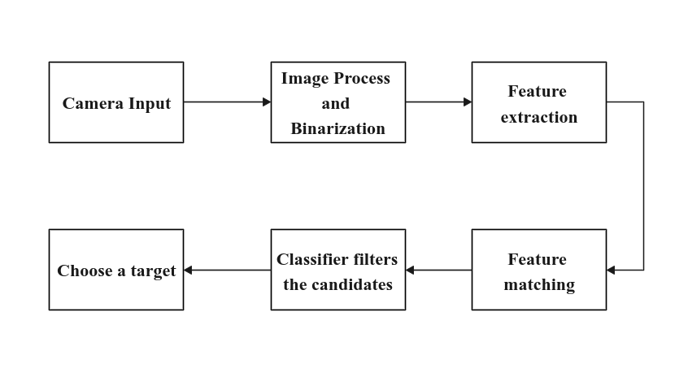

# Object detection
I combined the traditional computer vision method based on the geometric feature extraction and 
the neutral network method, our detection for some specific objects achieves real-time (150fps+) on TX2 for an image with 640x480 resolution and it is robust enough to work on most normal situations. 
<!-- 基于几何特征提取的传统视觉方法和神经网络相结合的方法，实现了对特定对象的实时监测。将算法部署在TX2上，对于一个640x480分辨率的图像平均帧率达到150+fps，且算法具有足够的鲁棒性，可以在大多数正常情况下工作。 -->

    

<iframe width="1280" height="500" src="https://www.youtube.com/embed/8MPJoGlX35o" title="YouTube video player" frameborder="0" allow="accelerometer; autoplay; clipboard-write; encrypted-media; gyroscope; picture-in-picture" allowfullscreen></iframe>