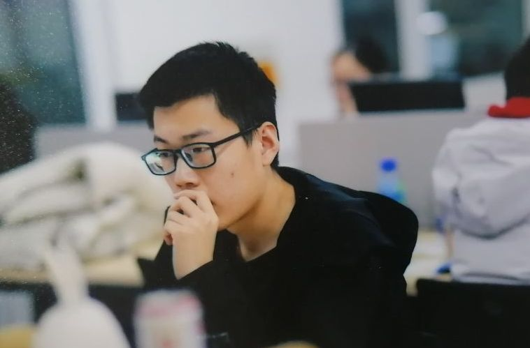

# About Me

I'm currently a senior undergraduate student majoring in Robot Engineering at Harbin Institute of Technology, China.

As a member of the algorithm department of the robot Team in Harbin Institute of Technology, I am mainly responsible for coding and designing the control algorithm and auto-aim algorithm for the robots in the Robomaster 2021/2022. In 2022, I became the deputy captain of the team and leader of the algorithm department, mainly responsible for developing high performance robot detection and tracking algorithm and designing maneuvering target prediction algorithm. We both won the Second Prize in the Final Round of the National College Students’ RoboMaster robotic Competition and First Prize in the Final Round of the National College Students’ RoboMaster robotic Competition Individual Finals.

Recently, I'm doing an internship in Discover Lab of Tsinghua University. 

Finding meaning in my work is important to me. I prefer to work with passionate teams on projects with the potential to bend the future of humanity towards better outcomes.

<!-- 我目前是哈尔滨工业大学（威海）机器人工程专业的一名大三本科生。

作为哈尔滨工业大学（威海）竞技机器人队算法部门的一员，我主要负责21赛季、22赛季Robomaster机器人控制算法和自动瞄准算法的设计与实现。2022年，我成为团队副队长兼算法部门负责人，主要负责开发高性能机器人检测与跟踪算法，设计机动目标预测算法。在2021年Robomaster的决赛中获得了二等奖。

在工作中找到意义对我来说很重要。我更喜欢与充满激情的团队一起工作，从事那些有潜力使人类的未来朝着更好的结果发展的项目。 -->

<!-- Hoping to contribute to open source robotics. -->

    

