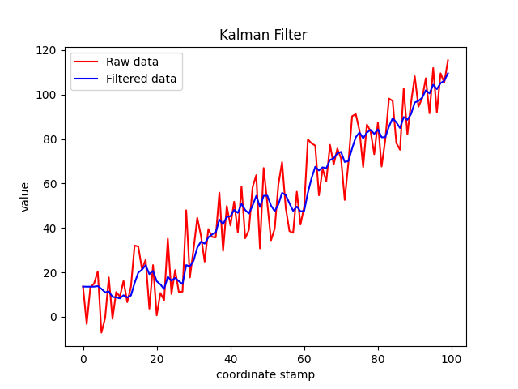

# Motion Predict
## Coordinate Transformations

In order to meet the requirement of hit ratio, the gimbal is required to predict the motion of the target during tracking, and the motion prediction needs to estimate the motion state of the target in the inertial frame.

We can get the coordinates of the target in the camera frame through pnp algorithm.
$$
^CP\,=\,[x_c,y_c,z_c]^T
$$
According to the installation position of the camera,  the coordinates of the target in the gimbal frame can be obtained.
$$
^BP\, =\, _C^BT^CP
$$
Then We can use IMU to obtain the coordinate transformation matrix from gimbal frame to inertial frame, and the inertial frame coordinate of the target is obtained by transforming the target coordinates from gimbal frame to inertial frame.
$$
^NP\,=\,_B^NR^BP
$$

## Kalman Filter

Kalman Filter is designed to estimate the position and velocity of the target in inertial frame by using uniform velocity model. Motion prediction and trajectory compensation are realized through target motion state and trajectory model, so as to obtain yaw axis and pitch axis expected angle of gimbal, and finally achieve target tracking and strike by gimbal control system.

    

## Demo

<iframe width="1000" height="400" src="https://www.youtube.com/embed/qpviym5JZWY" title="YouTube video player" frameborder="0" allow="accelerometer; autoplay; clipboard-write; encrypted-media; gyroscope; picture-in-picture" allowfullscreen></iframe>